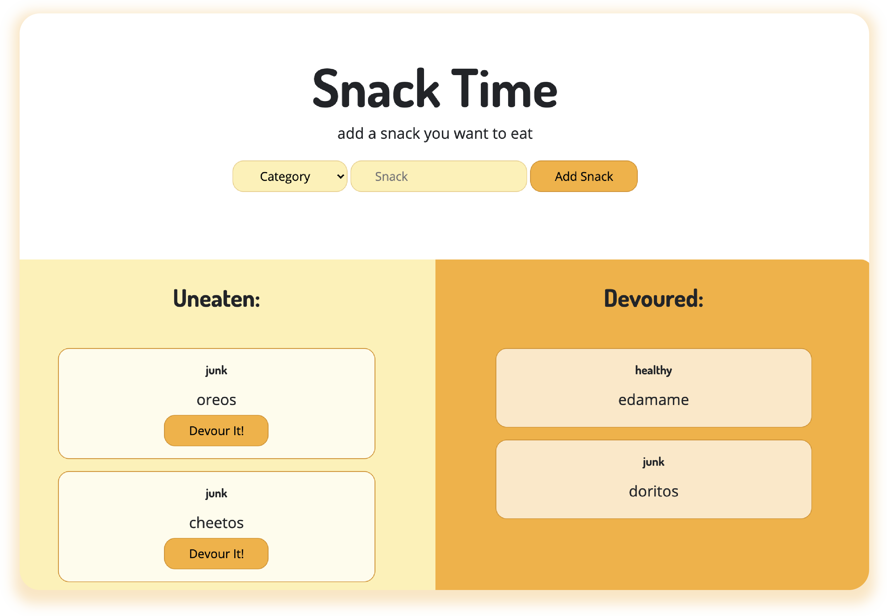

# Snack Time
This simple application lets users add and eat their favorite snacks. Users can add new 
snacks and classify if they are heathy foods or junk foods. Then they can log which 
snacks they've eaten!



## Functionality 
```
WHEN I visit the application
THEN I can see my current lists of foods uneaten and devoured
WHEN I add a new food item, including its name and healthiness
THEN the food item is added to my 'uneaten' column
WHEN I click 'Devour It!' on an uneaten food item
THEN the food item is added to my 'devoured' column
WHEN I reload the page
THEN all of my current displayed data persists
```

## Credits
This App uses [MySQL](https://www.npmjs.com/package/mysql), [Express](https://www.npmjs.com/package/express), and [Express Handlebars](https://www.npmjs.com/package/express-handlebars). 

## Other Work
You can see some of my other work at <https://github.com/kimcredit>.    

## License
Copyright (c) 2020 Kim Credit.